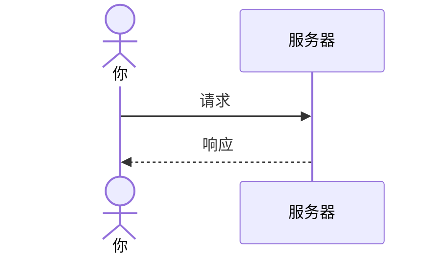
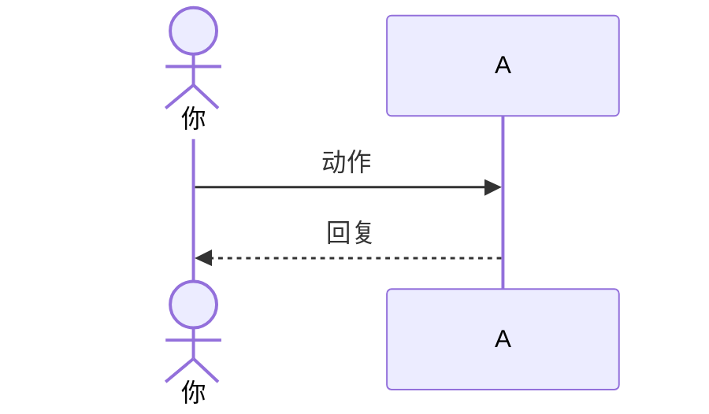
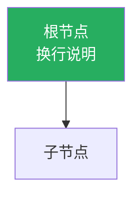

# Blog Writing Format Specification

Standard format for all blog posts in `src/content/blog/`. Follow these rules to ensure compatibility with the website.

## 1. Frontmatter

Every blog post must start with `---` delimited frontmatter.

### Template

```yaml
---
title: "文章标题"            # 必填，可包含 emoji
date: "2026-05-01"          # 必填，日期必须加引号
time: "14:30"               # 可选，24小时制，用于时段分类
pinned: 1                   # 可选，数字越小越靠前
tags:                       # 可选
  - 标签1
  - 标签2
visibility: 公开             # 可选：公开 / 私密 / 草稿，默认公开
description: 文章摘要       # 可选，显示在文章列表
---
```

### Frontmatter Rules

- `date` **必须加引号**：`date: "2026-05-01"` — 不加引号 YAML 会解析成 Date 对象导致 schema 报错
- 分隔符必须是 `---`（三个减号），不能用 `***`
- 冒号必须是半角 `:`，不是全角 `：`
- 注释用 `#`（YAML 行尾注释或整行注释）

### Field Ordering Convention

```
title → date → time → pinned → tags → visibility → description
```

## 2. Headings

- 文章内章节标题使用 `##`（二级标题）— CSS 会自动添加分割线
- 不要用 `#`（一级标题），没有分割线
- `###`（三级标题）用于章节内的小分类

```markdown
## 章节标题             ← 有分割线

### 小标题              ← 无分割线，字号小于 ##
```

## 3. Paragraph Indentation

- 使用 `&emsp;` 缩进，不要敲空格
- 每段开头两个 `&emsp;&emsp;` = 缩进两个汉字宽度
- 行首 4 个空格会被渲染成代码块

```markdown
&emsp;&emsp;这是正文第一段，首行缩进了两格。

&emsp;&emsp;第二段正文。段落之间空一行即可。
```

## 4. Images

照片放在 `public/images/` 中，引用路径为 `/images/文件名.jpg`。

**推荐使用 HTML 语法**（可控制宽度）：
```html

```

**Markdown 语法**（不能调大小）：
```markdown

```

- 只设 `width` 不设 `height`，自动等比缩放
- 图片如需换行，在末尾加 `<br>`
- 居中显示用：`<div style="text-align: center;">内容</div>`

## 5. Tables

Markdown 表格语法，网站 CSS 已添加边框和斑马纹。

```markdown
| 列1 | 列2 | 列3 |
|-----|-----|-----|
| 数据 | 数据 | 数据 |
| 数据 | 数据 | 数据 |
```

表格前建议加一行描述文字。

## 6. Mermaid Diagrams

用于替代 ASCII 艺术图。代码块语言标识为 `mermaid`，网站会自动渲染。

````markdown

````

### 常用图表类型

**sequenceDiagram** — 时序图（请求/响应流程）：


**graph LR** — 从左到右流程图：


**graph TD** — 从上到下流程图/树形图：


- 节点内换行用 `<br>`
- 节点样式用 `style 节点ID fill:#颜色,color:#fff`

## 7. Code Blocks

使用围栏代码块并指定语言：

````markdown
```javascript
console.log("hello");
```

```bash
npm run dev
```

```text
# 纯文本内容
```
````

## 8. Other Markdown

```markdown
**加粗文字**
*斜体文字*
`行内代码`
- 无序列表项
1. 有序列表项

> 引用文字
```

## 9. Emojis

鼓励使用 emoji 体现个人风格和语气。直接粘贴 Unicode emoji 即可。

## 10. File Naming

- 文件名即 URL 中的 id
- 中文文件名可用，但需保持唯一
- 建议格式：`简短描述-用关键词.md`
- 示例：`网页三件套-HTML-CSS-JavaScript到底在做什么.md`

## 11. Time Period Classification

在 frontmatter 中添加 `time` 字段，文章列表会自动显示时段标签：

| 时段 | 小时范围 |
|------|---------|
| 凌晨 | 0:00-4:59 |
| 早晨 | 5:00-6:59 |
| 上午 | 7:00-10:59 |
| 中午 | 11:00-12:59 |
| 下午 | 13:00-17:59 |
| 晚上 | 18:00-21:59 |
| 深夜 | 22:00-23:59 |

不填 `time` 则无时段标签。

## 12. Pinned Articles

```yaml
pinned: 1    # 数字越小越靠前
pinned: 2
pinned: 3
```

有 `pinned` 字段的文章出现在列表顶部"📌 置顶文章"区域。

## 13. Pre-Publish Checklist

每次创建新博客后检查：

- [ ] frontmatter 分隔符是 `---`（不是 `***`）
- [ ] `date: "2026-05-01"`（加了引号）
- [ ] 所有冒号是半角 `:`（不是全角 `：`）
- [ ] 章节标题用 `##`（不是 `#`）
- [ ] 没有行首空格或 Tab（会被当代码块）
- [ ] 如需时段分类，加了 `time: "14:30"`
- [ ] 如需置顶，加了 `pinned: 1`
- [ ] ASCII 艺术图已替换为 Mermaid 图表
- [ ] `npm run build` 通过无报错
