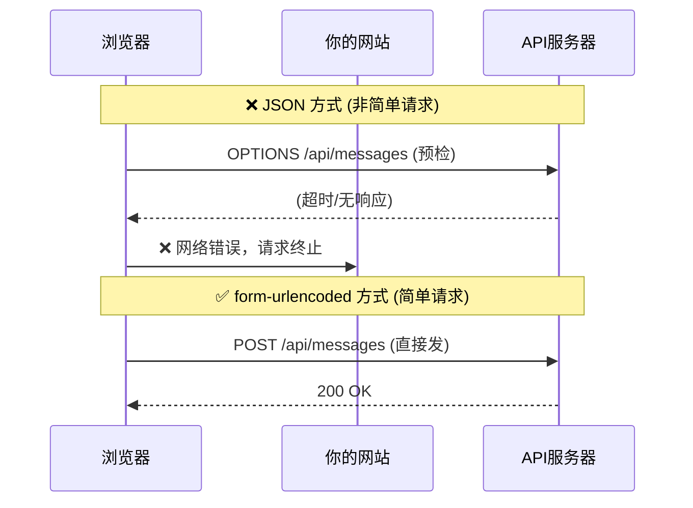

&emsp;&emsp;最近给网站加了一个留言板块——横向无限滚动的留言墙，类似于 Magic UI 的 Marquee 组件效果。看起来很简单对吧？事实上我也这么觉得。然后就被现实教育了。

&emsp;&emsp;这篇文章记录下我踩的三个坑，每一个都让整个组件完全失效。而且这些坑不是"我不小心写错了"的那种，而是即使逻辑完全正确、代码该写的都写了，它就是不行的那种。所以值得记下来。

---

## 故障一：样式写好了，但 JS 生成的 HTML"看不见"样式

### 现象

&emsp;&emsp;留言组件渲染出来了，但消息卡片完全没有样式——没有边框、没有圆角、没有颜色。更奇怪的是，那些卡片没有横向排列，而是像普通段落一样竖直堆叠。滚动动画也没有。

&emsp;&emsp;但我明明写了 CSS 啊。`msg-card` 类名匹配上了，`border`、`display: flex`、`animation` 全写了。审查元素也看到类名正确——但样式就是没生效。

### 成因

&emsp;&emsp;这是 **Astro 框架的 CSS 作用域机制** 导致的。

&emsp;&emsp;Astro 有一个设计：组件里的 `<style>` 标签默认是"作用域化"的。什么意思呢？编译的时候 Astro 会给你组件里的每个 HTML 元素自动加上一个特殊属性，比如 `data-astro-cid-abc123`，然后把你的 CSS 选择器改写成：

```css
/* 你写的 */
.msg-card { border: 1px solid; }

/* Astro 实际发布的 */
.msg-card[data-astro-cid-abc123] { border: 1px solid; }
```

&emsp;&emsp;这样样式就被"锁定"在这个组件里，不会泄漏到页面其他地方——这是好设计，防止样式冲突。

&emsp;&emsp;但问题来了：我的留言卡片是通过 JavaScript 的 `innerHTML` **动态创建**的。JS 在浏览器里运行时创建的 DOM 元素，不可能有 Astro 在编译时加的那个 `data-astro-cid-abc123` 属性。所以 `.msg-card[data-astro-cid-abc123]` 这个选择器永远匹配不上动态生成的卡片——样式自然就无效了。

```text
你写了一个组件：
  <style>
    .card { border: 1px solid; }
  </style>
  <div id="container"></div>
  <script>
    // 运行时的 JS
    container.innerHTML = '<div class="card">...</div>';
  </script>

Astro 编译后实际变成了：
  <style>
    .card[data-astro-cid-xxx] { border: 1px solid; }
    /* ↑↑ 要求有 data-astro-cid-xxx 属性 */
  </style>
  <div id="container" data-astro-cid-xxx></div>
  <script>
    // 运行时创建的 div class="card" —— 没有 data-astro-cid-xxx！
    // 所以样式匹配不上！
  </script>
```

### 解决方法

&emsp;&emsp;使用 `is:global` 指令，告诉 Astro"这个样式块是全局的，不要加作用域限制"：

```astro
<!-- ❌ 默认作用域样式 -->
<style>
  .msg-card { border: 1px solid; }
</style>

<!-- ✅ 全局样式 -->
<style is:global>
  .msg-card { border: 1px solid; }
</style>
```

&emsp;&emsp;加了 `is:global` 之后，CSS 选择器保持原样，动态生成的 HTML 也能匹配上。

### 什么时候会踩这个坑？

&emsp;&emsp;只要你在 Astro 组件里**用 JS（或任何客户端脚本）通过 innerHTML 动态生成 HTML**，并且那个动态 HTML 需要应用组件里的样式，就会遇到这个问题。

&emsp;&emsp;常见的场景：
- 留言板、评论列表（内容从 API 获取后 JS 渲染）
- 客户端搜索筛选结果
- JS 生成的图表或卡片

---

## 故障二：用 JSON 发请求，浏览器先"打了个电话确认"

### 现象

&emsp;&emsp;留言提交功能写好了，点击发送——报错："❌ 网络错误，请检查连接"。但后端明明收到请求了，数据也存了。而且 GET 请求完全正常，只有 POST 不行。

### 成因

&emsp;&emsp;这是 **CORS 预检请求（Preflight）** 机制。

&emsp;&emsp;我的前端是 `xxs.beauty`，后端 API 是 Cloudflare Worker（`*.workers.dev`）——不同域名。浏览器有安全策略：跨域请求不能随便发。

&emsp;&emsp;但关键区别来了：**不是所有跨域请求都会触发预检**。浏览器把跨域请求分两类：

| 类型 | 条件 | 行为 |
|------|------|------|
| 简单请求 | `Content-Type` 是 `form-urlencoded`、`form-data` 或 `text/plain` | 直接发请求，浏览器自动处理跨域 |
| 非简单请求 | `Content-Type` 是 `application/json` 等 | 先发一个 `OPTIONS` 请求"问问能不能发" |

&emsp;&emsp;我一开始用的 `Content-Type: application/json`，属于**非简单请求**。浏览器在正式 POST 之前，先发了一个 OPTIONS 请求去问服务器"我可以 POST 吗？"。在网络不稳定的环境下（比如我的服务器在中国访问受限），这个 OPTIONS 请求超时了——浏览器直接拒绝发送正式请求，报"网络错误"。



### 解决方法

&emsp;&emsp;把请求方式从 JSON 改为 `application/x-www-form-urlencoded`，这是一个"简单请求"，浏览器不会触发 OPTIONS 预检，直接发送。

```javascript
// ❌ 会触发预检的 JSON 方式
var xhr = new XMLHttpRequest();
xhr.open('POST', apiUrl + '/api/messages', true);
xhr.setRequestHeader('Content-Type', 'application/json');
xhr.send(JSON.stringify({ name: '匿名', message: '你好' }));

// ✅ 不会触发预检的 form-urlencoded 方式
var xhr = new XMLHttpRequest();
xhr.open('POST', apiUrl + '/api/messages', true);
xhr.setRequestHeader('Content-Type', 'application/x-www-form-urlencoded');
xhr.send('name=' + encodeURIComponent('匿名') + '&message=' + encodeURIComponent('你好'));
```

&emsp;&emsp;同时，后端也要做相应的修改：从解析 JSON body 改为解析 form-data。我的 Worker 为了兼容两种方式，做了一下检测：

```javascript
const contentType = request.headers.get('content-type') || '';
if (contentType.includes('application/json')) {
  const body = await request.json();
  name = body.name;
} else {
  const formData = await request.formData();
  name = formData.get('name');
}
```

### 这个坑的通用教训

&emsp;&emsp;如果你的前端站点和后端 API 在不同域名（CORS 环境），且你发现 POST 偶尔失败、GET 永远正常——很可能是 OPTIONS 预检请求出了问题。

&emsp;&emsp;能不用 JSON 就不用 JSON？不是。如果你的后端和前端在同一个域名下（同源），用 JSON 完全没问题。但在跨域场景下，`form-urlencoded` 更简单可靠。或者你也可以后端正确响应 OPTIONS 请求——但前提是 OPTIONS 请求本身必须能到达服务器。

---

## 故障三：用别人的组件，但自己的项目不兼容

### 现象

&emsp;&emsp;看到了 Magic UI 的 Marquee 组件，效果非常完美——水平无限滚动、卡片样式、悬停暂停。心想："正好有 Magic UI 的 MCP，直接拿来用。"结果发现装不上。

### 成因

&emsp;&emsp;Magic UI 的组件是用 **React + Tailwind CSS** 写的。而我的项目是 **纯 Astro + 纯 CSS**——没有 React、没有 Tailwind。Magic UI 提供的组件源码长这样：

```tsx
// Magic UI 的组件 —— React + Tailwind
export function Marquee({ className, reverse, children }) {
  return (
    <div className={cn("group flex gap-(--gap)", className)}>
      {children}
    </div>
  );
}
```

&emsp;&emsp;这个组件依赖：
1. **React 运行时** — `.tsx` 语法、JSX、组件生命周期
2. **Tailwind CSS** — `group`、`gap-(--gap)` 等工具类需要 Tailwind 编译器
3. **`cn()` 工具函数** — 需要 `clsx` + `tailwind-merge`

&emsp;&emsp;我的项目里一个都没有。

### 解决方法

&emsp;&emsp;不能直接用，但可以 **提取核心逻辑，用纯 CSS 复刻**。

&emsp;&emsp;Magic UI 的 Marquee 核心就是几个 CSS 概念：

| Magic UI | 纯 CSS 实现 |
|----------|------------|
| `animate-marquee` | `@keyframes marquee-scroll { from { translateX(0) } to { translateX(-100%) } }` |
| `reverse` | `animation-direction: reverse` |
| `pauseOnHover` | `.track:hover .group { animation-play-state: paused }` |
| `repeat={4}` | JS 循环生成内容 `<div class="group">...</div>` ×4 |
| `--duration:40s` | CSS 自定义属性 `--duration: 40s` |
| `--gap:1rem` | CSS 自定义属性 `--gap: 1rem` |

&emsp;&emsp;纯 CSS 实现的核心代码：

```css
.msg-group {
  flex-shrink: 0;
  display: flex;
  align-items: center;
  gap: var(--gap);
  animation: marquee-scroll var(--duration) linear infinite;
}

.marquee-reverse .msg-group {
  animation-direction: reverse;
}

.marquee-track:hover .msg-group {
  animation-play-state: paused;
}

@keyframes marquee-scroll {
  from { transform: translateX(0); }
  to { transform: translateX(calc(-100% - var(--gap))); }
}
```

&emsp;&emsp;就这样——不需要任何框架，不需要任何工具库，纯 CSS 就能实现一模一样的滚动效果。

### 这个坑的通用教训

&emsp;&emsp;看到漂亮的开源组件时，先检查它依赖什么技术栈。如果和你的项目不兼容，不要放弃——分析它的实现原理，往往核心逻辑就是几行 CSS 而已。那些花哨的框架封装，剥开来看，底层的原理并不复杂。

&emsp;&emsp;而且自己用纯 CSS 实现的好处是：**零依赖、零负担、完全可控**。不会因为升级了某个框架版本导致组件挂掉。

---

## 三个坑的共同规律

&emsp;&emsp;回头看这三个故障，其实有一个共同点——都是 **工具/框架做了某种"保护"但反过来伤害了你**：

| 故障 | 谁的"保护" | 保护目的是？ | 后果 |
|------|-----------|-------------|------|
| CSS 作用域 | Astro | 防止样式泄漏到其他组件 | 动态 HTML 匹配不上样式 |
| CORS 预检 | 浏览器 | 防止恶意跨域请求 | 正常请求被拦截 |
| React 组件 | Magic UI | 提供复用性好的组件 | 不兼容纯 CSS 项目 |

&emsp;&emsp;框架做的每个"保护"，都是有代价的。当你做了一些框架设计预期之外的事情——比如在 Astro 组件里动态生成 HTML、在跨域场景下用 JSON、在一个纯 CSS 项目里用 React 组件——这些保护机制就会反过来成为障碍。

&emsp;&emsp;知道它们的存在，知道它们的触发条件，就能在遇到问题的时候快速定位。这也是我写这篇文章的原因——连 AI 都会踩这些坑，说明它们确实太隐蔽了。

---

## 总结速查表

```text
故障                    症状                            原因                         解决
──────                  ─────                           ──────                        ──────
Astro CSS 作用域         样式写了但 JS 动态生成的            Astro 给 CSS 加了              使用 <style is:global>
                        元素没有样式                       data-astro-cid 属性限制

CORS 预检请求            POST 请求偶发网络错误               JSON Content-Type              改用 application/
                        但 GET 正常                       触发 OPTIONS 预检               x-www-form-urlencoded

技术栈不兼容             想用的组件装不上                    React/Tailwind 组件            提取核心 CSS 逻辑
                        或在纯 CSS 项目里                                          + 动画，用纯 CSS 复刻
```
