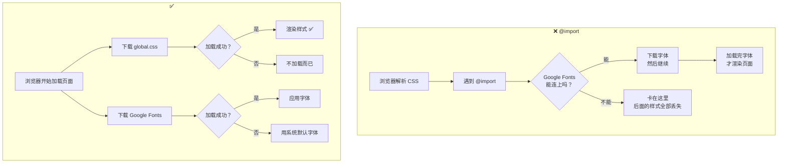

&emsp;&emsp;前几天我网站出了一个特别鬼的问题：打开网站，所有样式都没了——没有颜色、没有排版、按钮扁平的、文字挤在一起，整个页面赤裸裸的 HTML 原始模样。刷新几次又好了，过一会儿又崩了。

&emsp;&emsp;排查到最后，罪魁祸首是 `global.css` 文件里第一行代码。这行代码本身跟我网站的所有样式一点关系都没有——它只是去 Google 下载一个字体。但就是这一行，让整个 CSS 文件废了。

---

## 先从那次故障讲起

&emsp;&emsp;我的 `global.css` 长这样（第一行是问题所在）：

```css
@import url('https://fonts.googleapis.com/...');  ← 这一行
:root {
  --color-primary: #5DADE2;
  --color-bg: #F8F9FA;
}
.container { ... }
.btn { ... }
.card { ... }
/* ……后面上百行样式 */
```

&emsp;&emsp;这看起来只是一行"引用字体"的代码，但它有一个致命的问题——**@import 会让整个 CSS 文件等它**。

&emsp;&emsp;在中国网络环境下，Google 的服务时好时坏。当它连不上时，浏览器解析到 `@import` 就卡住了，后面的上百行样式（包括所有颜色、布局、按钮）全部没被执行。网站就变成了"裸奔"状态。

---

## 那 @import 到底是什么？

&emsp;&emsp;`@import` 是 CSS 的一种文件引用机制。它的字面意思就是"引入"——你可以在一个 CSS 文件里通过 `@import` 引入另一个 CSS 文件。

```css
/* style.css */
@import url('reset.css');
@import url('theme.css');
body { background: #fff; }
```

&emsp;&emsp;这看起来挺方便的，可以拆分文件。但关键问题是——**浏览器遇到 `@import` 时，会停止解析当前文件，去下载 `@import` 指向的文件，下载完毕后再回来继续。** 也就是说，前面 `@import` 的东西没搞定，后面所有代码都得等着。

&emsp;&emsp;这是 CSS 的一个历史遗留设计。早期的网页开发确实这么用过，但现在已经不推荐了。

---

## 那正确的做法是什么？

&emsp;&emsp;用 HTML 的 `<link>` 标签代替 CSS 的 `@import`。

```html
<!-- ✅ 正确：在 HTML 里用 link 标签 -->
<link rel="stylesheet" href="style.css" />
<link rel="stylesheet" href="https://fonts.googleapis.com/..." />
```

&emsp;&emsp;HTML 的 `<link>` 是**并行加载**的。浏览器看到两个 `<link>`，会同时下载它们，哪个先下载完就先解析哪个。一个失败了，不影响另一个。你的样式文件正常解析，字体文件加载失败也只是没有特殊字体而已——整个网站的功能和外观丝毫不受影响。

---

## 一个图把区别说清楚



&emsp;&emsp;看明白了吗？`@import` 是串联的——一个人卡住，全队等。`<link>` 是并联的——各自跑各自的，谁出问题不影响别人。

---

## 那为什么 Google Fonts 会影响？字体不是网站自带的吗？

&emsp;&emsp;这是一个很多人会搞混的点。我分两步讲清楚。

### 第一步：字体到底是什么？

&emsp;&emsp;字体文件（如 `.woff2`）本质上和图片（`.jpg`）是一样的——都是一个需要下载的外部资源。

- `img` 标签加载图片 → 下载图片 → 显示在网页上
- `link` 标签加载字体 → 下载字体 → 用来渲染文字

&emsp;&emsp;你的电脑里只预装了几十种常用字体（宋体、黑体、微软雅黑、Arial 等）。ZCOOL KuaiLe、Inter、Gaegu 这些好看的特色字体，系统没有，需要额外下载。

### 第二步：下载之后怎么办？

&emsp;&emsp;下载的字体**只存在于浏览器的缓存中**，不会安装到系统里。在这个网站上看得到特殊字体，换个网站就没了。而且浏览器会缓存好字体，不是每次打开都重新下载——第一次下载后，后续访问直接读缓存。

---

## 用做菜的比喻彻底搞懂

```text
@import 的方式：
你拿到菜谱（CSS 文件），上面第一行写着：
"第1步：打电话给隔壁老王借个特殊模具（@import Google Fonts）"
"第2步：切菜（:root 定义颜色）"
"第3步：炒菜（.btn .card 等样式）"

你开始打电话，老王一直不接。
你手就一直举着电话等，后面切菜炒菜的事全停下来了。
最后饭没做成——因为第1步没完成，你就不开始第2步。

<link> 的方式：
你拿到菜谱（CSS 文件）：
"第1步：切菜"
"第2步：炒菜"
"第3步：装盘"

同时让另一个人（<link>）去打电话借模具。
他打不通就不打了，你用普通模具也能做菜。
饭做成了，只是没有特殊花纹而已——但能吃。
```

---

## 总结

| 加载方式 | 加载特性 | 一个失败影响其他？ | 推荐？ |
|----------|----------|-------------------|--------|
| `@import` | 串行等待 | ❌ 会阻塞整个 CSS | 不推荐 |
| `<link>` | 并行加载 | ✅ 互不影响 | 推荐 |

&emsp;&emsp;一个原则很简单：**能用 `<link>` 就别用 `@import`**。不只是字体，所有 CSS 文件的加载都应该用 `<link>` 而不是 `@import`。`@import` 是 CSS 早期的设计，现在已经是一种过时且危险的做法了。

&emsp;&emsp;你可能会在某一些 CSS 框架或教程里看到 `@import` 的写法——尤其是那些教你"在 CSS 文件开头引入字体"的教程。现在你知道它的问题了：**每当你把 `@import` 放在 CSS 第一行，你就在赌那个外部资源永远不会挂。** 而在实际网络中，没有什么是永远稳定的。

&emsp;&emsp;我的网站现在改成了用 `<link>` 加载 Google Fonts。如果你打开它时字体看起来和我的设计稿不一样——那说明字体下载没成功，但你的浏览体验依然是完整的。因为所有颜色、布局、功能都还在，只是文字看起来朴素了一点。这，才是正确的做法。
