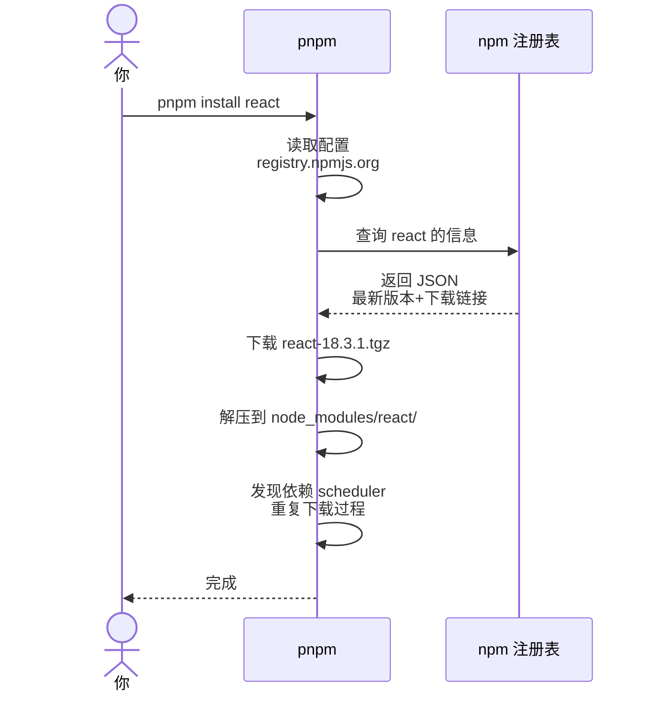
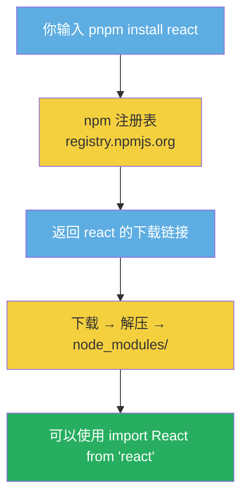

## 一个奇怪的问题

想象一下，你在终端里输入：

```bash
pnpm install react
```

然后电脑就开始下载东西了。但是你有没有想过一个问题——**电脑怎么知道"react"是什么？**

这个世界上的软件那么多，你随便说一个名字，电脑就找到了。这就像你跟一个人说"你去找一个叫张三的人"，世界上可能有几万个叫张三的，哪个才是你要找的？

刚接触这东西的时候我一直很困惑。这篇文章就把这个问题彻底拆清楚。

## 其实底层就是一个链接

先揭晓答案：`pnpm install react` 的背后，实际上就是**自动完成了一个下载链接的查找和下载过程**。

过程是这样的：



所以你猜得完全正确——**命令行的下载本质上就是去一个固定的地址查名字，拿到真正的下载链接，然后下载。**

## 这个"地址簿"是谁维护的？

npm 注册表（registry.npmjs.org）是 npm 公司运营的一个大型数据库。

它到底有多大？截至 2025 年，npm 注册表里已经有**超过 300 万个包**，是世界上最大的软件注册表。没错，比任何一个操作系统的包管理器都多。

每个包发布到 npm 时，发布者需要提供一个名字。这个名字在注册表里是**唯一**的——先到先得。如果别人已经注册了 `react`，你就不能再用了。

但是 npm 也提供**命名空间机制**：

- 简单名字如 `react`：全球唯一
- 带 scope 的名字如 `@magicui/globe`：`@magicui` 是组织名，`globe` 是这个组织下的包名。不同组织可以有同名的包，互不冲突

这就像一个路牌系统——简单名字是"北京路"，全国只能有一个；而带 scope 的名字是"广州市·北京路"和"深圳市·北京路"，互不干扰。

## C++ 的头文件又是怎么回事？

这就要说到 C++ 和前端的一个核心差异了。

当你在 C++ 中写 `#include <iostream>` 时，这个文件是你**安装编译器时就已经在你的电脑里了**。以 Windows 上的 MSVC 为例：

```text
C:\Program Files\Microsoft Visual Studio\2022\Community\VC\Tools\MSVC\14.x.xxxxx\include\
    ├── iostream
    ├── vector
    ├── string
    └── ...
```

这些文件在安装 Visual Studio 时就被复制到了你的电脑里。所以你写 `#include` 的时候，编译器能在本地找到它们。

**但是前端的库不是这样的。**

前端没有"系统级标准库"的概念。每个项目各自独立，你需要什么库，就在这个项目里安装什么库：

```text
项目A/
└── node_modules/
    ├── react@18.3.1      ← 项目A 需要 react

项目B/
└── node_modules/
    ├── react@17.0.2       ← 项目B 需要不同版本的 react
    └── vue@3.4.0          ← 项目B 还用了 vue
```

每个项目的 `node_modules/` 都是独立的，删了重新 `pnpm install` 就好了。

## C++ 标准库到底有多少？

这是顺便回答我在文章开头的问题。

C++ 标准库头文件大约有 **100 个左右**。C 标准库头文件有 **29 个**。这些是由 C++ 标准化委员会（ISO）决定的，只有他们能添加新的标准库。

但第三方库就不一样了——任何人都可以创建并发布。GitHub 上仅 C++ 相关的库就有数十万。你通过 vcpkg、conan 这些包管理器来安装它们。

所以 C++ 的第三方库和前端是一个道理——都需要包管理器来下载和管理。

## 那 pnpm / npm 这些包管理器到底做了什么

核心功能就是三件事：

1. **查找**——根据包名去注册表查下载地址
2. **下载**——下载压缩包并解压到 `node_modules/`
3. **依赖管理**——自动下载这个包所依赖的其他包

第三点尤其重要。比如你装一个组件，它可能依赖于 React、Three.js、以及一些工具库。包管理器会自动帮你把这些都装上，不需要你一个一个去装。

## 回到最根本的问题：命令行为什么能下载东西？

这个问题可以一直往下追问，直到最底层：

| 层次 | 你在做什么 | 类比 |
|------|-----------|------|
| 你输入的 | `pnpm install react` | 👈 你说"我要 react" |
| 包管理器 | 查注册表 → 获取下载链接 | 👈 "react 的地址是 xxx" |
| 操作系统 | 用 HTTP 协议下载文件 | 👈 "我要下载这个链接的文件" |
| 网络层 | TCP 连接 + 数据包传输 | 👈 "把文件拆成小包发过来" |
| 物理层 | 网线/WiFi 里的电信号 | 👈 "0101..."

你之前提到迅雷——本质上是一样的。你复制一个下载链接到迅雷，迅雷下载。包管理器也是一样，只是它替你多做了"查名字→找链接"这一步，而且能自动处理依赖。

## 关于"开源免费"的题外话

这些包管理器和注册表基本都是免费的。npm 注册表由 GitHub（微软旗下）运营，据估计年营收在 10-20 亿美元级别，主要来源是企业版和高级功能。

而对于 magic ui 这类小项目，生存成本其实很低：
- 服务器托管：每月 $5-20
- 域名：每年 $10-15
- 很多开发者是业余时间做的，不靠它赚钱

这就是为什么这么多好用的工具可以免费提供。

## 小结



整个流程就是**查地址簿 → 拿链接 → 下载 → 使用**。没有什么魔法，全都是一个个明确的操作步骤串联起来的。
