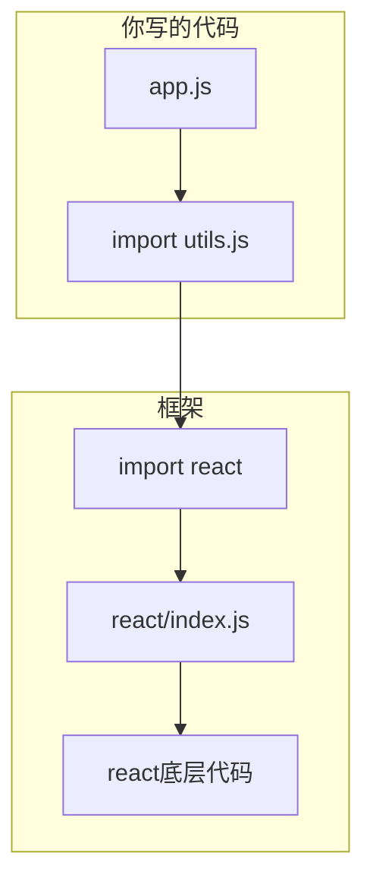

&emsp;&emsp;前几天我在开发网站上遇到一个问题：明明 Magic UI 有那么漂亮的组件，却没法直接用到自己项目里。换成 React + Tailwind 就能用，不用就"做不到"。这让我很困惑——这些效果不就是 CSS 和 JavaScript 吗？为什么必须要有框架才行？框架到底是什么东西？它到底做了什么事？

&emsp;&emsp;这篇文章是我搞懂之后的记录。

---

## 先说结论：你的直觉是对的

&emsp;&emsp;在回答之前，先确认一个前提：**所有框架能做到的事，用最朴素的代码也一定能做到。** 框架本身就是用朴素代码写出来的，它没有超能力。

&emsp;&emsp;这个道理就像 C++ 里的函数：你不用函数也能写程序，把所有逻辑都写在 `main` 里，从上到下执行完。但那样做的代码没法维护、没法复用、写起来还特别累。函数是为了让你**更方便**，不是为了给你**新的能力**。框架也是一样。

&emsp;&emsp;那问题来了：既然朴素代码什么都能做，为什么会有"没有框架就做不到"这种说法？

&emsp;&emsp;因为这里的"做不到"不是**逻辑上**做不到，而是**现实上**做不到。就像今晚你想吃一碗面，从种小麦开始做，理论上能做出来，但今晚肯定吃不上。

---

## 先从框架的历史讲起

### 没有框架的时代

&emsp;&emsp;1990 年第一个网页诞生，纯 HTML，没有 CSS，没有 JavaScript。那时候的网页就像一张打印出来的文档。

&emsp;&emsp;2000 年代，网页开始有交互了。当时的开发模式很简单：

```html
<form>
  <input type="text" name="username" />
  <input type="submit" />
</form>
```

&emsp;&emsp;点击提交 → 浏览器发送请求 → 服务器返回全新页面 → 浏览器重新渲染。每次操作都刷新整个页面，体验很差。

### 人们开始用 JS 手动操作页面

&emsp;&emsp;2005 年左右，AJAX 技术出现了。网页可以不刷新就更新内容。开发者开始用 JavaScript 直接操作 DOM（网页的文档对象模型）：

```javascript
var button = document.getElementById('myButton');
button.addEventListener('click', function() {
  var div = document.getElementById('myDiv');
  div.innerHTML = '新的内容';
  div.style.color = 'red';
});
```

&emsp;&emsp;看起来很简单对吧？但当页面越来越复杂，这种方式变得极其痛苦。

### 复杂度爆炸

&emsp;&emsp;想象一个评论区同时发生的事：
- A 用户发了一条评论
- B 用户点了一个赞
- C 用户回复了 A
- 通知栏的数字要加一
- 右上角的消息提示要闪烁

&emsp;&emsp;没有框架的时候，你需要自己跟踪每一个变化：

```javascript
function onNewComment(comment) {
  var list = document.getElementById('comments');
  list.appendChild(createCommentElement(comment));
  updateCommentCount(count + 1);
  updateNotificationBadge('新评论');
  if (comment.mentionedMe) {
    highlightMention(comment);
  }
}
```

&emsp;&emsp;每个交互都要手动写"更新哪里、怎么更新"。当交互越来越多，代码变成一团乱麻——你不知道什么时候该更新什么，很容易遗漏（改了界面但忘了更新数字）。

### 框架诞生

&emsp;&emsp;2011 年左右，React 诞生了。它的核心思想是：

> &emsp;&emsp;你不用告诉我怎么更新界面。你只要告诉我界面**应该变成什么样**，我来算怎么更新。

&emsp;&emsp;这就是框架做的事——帮你管理那些繁琐的、重复的、容易出错的事情。

---

## 框架到底是个什么东西？

&emsp;&emsp;从物理层面来说，**框架就是一个文件夹**。

&emsp;&emsp;当你运行 `npm install react` 时，你的电脑上会多出这样一个东西：

```text
node_modules/react/
  package.json         ← 描述文件（名字、版本、依赖了谁）
  index.js             ← 实际代码（几万行）
  ...
```

&emsp;&emsp;这个文件夹里的代码就是框架。你可以打开它、读它、甚至修改它。它和你自己写的 `utils.js` 没有任何本质区别——都是 JavaScript 代码。

&emsp;&emsp;从逻辑层面来说，**框架是别人替你写好的、打包好的、可以复用的代码集合**。

&emsp;&emsp;你写项目时，会写一些工具函数放在一个文件里，然后在需要的地方 `import` 使用。框架就是同样的道理，只不过规模更大、质量更高、维护的人更多。



---

## 那"没有框架做不到"是怎么回事？

&emsp;&emsp;拿我遇到的地球仪效果举例。Magic UI 的 Globe 用了一个叫 **cobe** 的库，这个库做的事情是：

> 你的电脑的显卡 → 运行 WebGL 代码 → 生成 3D 地球

&emsp;&emsp;cobe 这个库本身就是一坨 JavaScript 代码，没有任何魔法。我完全可以不用 cobe，自己写 WebGL 代码来生成 3D 地球。但需要做的事情包括：

1. 写几百行 GLSL（显卡着色器语言）代码
2. 计算球面坐标映射
3. 加载世界地图的纹理数据
4. 实现光照模型
5. 处理设备像素比
6. 处理窗口大小变化
7. 处理鼠标拖拽交互

&emsp;&emsp;**做得到吗？** 逻辑上完全可以。
&emsp;&emsp;**现实吗？** 这需要花一个星期。

&emsp;&emsp;所以我说"做不到"的时候，真正的意思是：**在合理的时间内、用合理的代码量，做不到。** 就像我说"今晚做不出一碗佛跳墙"——不是世界上没有佛跳墙这道菜，而是从买菜到炖好需要好几天。

---

## 用做菜的比喻彻底搞懂

```text
没有框架 = 从种小麦开始做一碗面

种小麦 → 收割 → 磨面粉 → 揉面 → 醒面 → 擀面 → 切面 → 煮面 → 端上桌

每一件事你都能做，但做一碗面需要一季。
而且每次做面都要从头开始种小麦。


用框架 = 去超市买挂面

烧水 → 下面 → 捞起 → 吃

挂面就是"别人替你处理好的半成品"。
你不用关心面粉是怎么磨的，面是怎么压的。

你只需要关心：你要吃面，怎么煮。


第三方库 = 买现成的调料包

比如你要做油泼面，买一包"油泼面料包"，
倒进去就行了，不用自己配辣椒面、花椒、蒜末的比例。
```

&emsp;&emsp;框架 + 第三方库 = 挂面 + 调料包。

&emsp;&emsp;你吃的是一碗好面，不是挂面也不是调料包。工具不重要，重要的是你做出的东西。但有了好的工具，你做起来更快、更轻松、更稳定。

---

## 关于性能的疑惑

&emsp;&emsp;你可能会想：用了框架难道不是一定会损失性能吗？

&emsp;&emsp;答案有点反直觉：**有时候是，但更多时候框架反而更快。**

&emsp;&emsp;拿更新一个列表来举例：

```javascript
// 手写 —— 看似"更直接"
for (var i = 0; i < 100; i++) {
  var el = document.createElement('div');
  el.textContent = data[i];
  container.appendChild(el);
  // 每次 appendChild 都会触发页面重新计算布局
}

// 用框架 —— 看似"多了一步"
// 但框架会批量处理这 100 次操作，
// 最后只触发一次页面重新计算
```

&emsp;&emsp;手写代码就像你亲自开车送 100 个人去机场——一个人跑一趟，跑 100 趟。
&emsp;&emsp;框架就像你叫了一辆大巴——一次把 100 个人都送过去。

&emsp;&emsp;看起来大巴绕路了（多了一层抽象），但实际上效率更高。

---

## 现在再看 Magic UI 的问题

&emsp;&emsp;回到最初的问题：为什么 Magic UI 的效果不能直接用在我的纯 CSS 项目里？

&emsp;&emsp;因为 Magic UI 的组件是一包"挂面+调料包"：

| 组件 | 依赖的"半成品" |
|------|---------------|
| Kinetic Text | React 组件系统 |
| Globe | cobe (3D 引擎) + motion (物理动画) |
| Shiny Button | motion (动画控制) |
| Particles | 313 行的 canvas 引擎 |
| Theme Toggler | next-themes (主题管理) |

&emsp;&emsp;我的项目里一个都没有。所以我要复刻这些效果，相当于：
- 不买挂面，从种小麦开始
- 不买调料包，自己配比

&emsp;&emsp;做出来是一模一样的味道吗？可以，花足够多的时间就行。
&emsp;&emsp;值得吗？这就是工程决策了。

---

## 总结

```text
框架是什么？     别人写好的、打包好的、可复用的代码（物理上是一个文件夹）
框架解决了什么？ 帮你管理复杂、减少重复代码、提高开发效率
没有框架做不到？ 逻辑上都能做到，但现实上时间和代码量不允许
用了框架会变慢？ 适当使用反而更快，框架经过大量优化
框架怎么来的？  从朴素代码写出来的，后来被提取成可复用的包
```

&emsp;&emsp;框架不提供新能力，它提供的是**便利性和效率**。就像你吃饭不需要框架，但筷子比手抓更优雅、更快、更不烫手。

&emsp;&emsp;很多人把框架神秘化了，好像用了 React 就比不用 React 高一个维度。其实不是的。框架只是一个工具箱，里面装的都是普通工具。区别只是：工具箱里的人替你磨好了刀，你拿来就能用，不用自己去铁矿开釆、炼钢、锻打。

&emsp;&emsp;知道这个道理之后，再看那些"必须用某某框架"的说法，你就知道他们其实在说"用这个框架最省事"，而不是"不用这个框架就做不出来"。
