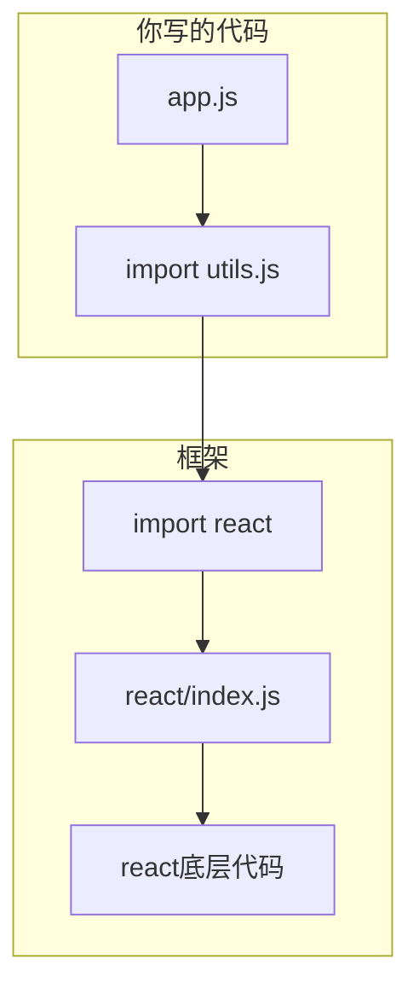

&emsp;&emsp;几年前我第一次接触"框架"这个词时，以为是一种很高深的东西。后来写了一个完整的网站，发现它不过是电脑里的一个文件夹，和你在项目里自己写的 `utils.js` 没有本质区别。

&emsp;&emsp;这篇文章不讲具体怎么用框架，而是从原理上回答几个问题：框架到底是什么？为什么会有不同的框架？Astro 和 React 有什么区别？如果一个网站不用框架会怎样？

---

## 先说结论

&emsp;&emsp;先确认一个前提：**所有框架能做到的事，用最朴素的代码也一定能做到。** 框架本身就是用朴素代码写出来的，它没有超能力。

&emsp;&emsp;这个道理就像 C++ 里的函数：你不用函数也能写程序，把所有逻辑都写在 main 里从上到下执行完。但那样做的代码没法维护、没法复用、写起来还特别累。函数是为了让你**更方便**，不是为了给你**新的能力**。框架也是一样。

&emsp;&emsp;那问题来了：既然朴素代码什么都能做，为什么会有"没有框架就做不到"这种说法？

&emsp;&emsp;因为这里的"做不到"不是**逻辑上**做不到，而是**现实上**做不到。就像今晚你想吃一碗面，从种小麦开始做，理论上能做出来，但今晚肯定吃不上。

---

## 先从框架的历史讲起

### 没有框架的时代

&emsp;&emsp;1990 年第一个网页诞生，纯 HTML，没有 CSS，没有 JavaScript。那时候的网页就像一张打印出来的文档。

&emsp;&emsp;2000 年代，网页开始有交互了。当时的开发模式很简单：

```html
<form>
  <input type="text" name="username" />
  <input type="submit" />
</form>
```

&emsp;&emsp;点击提交 → 浏览器发送请求 → 服务器返回全新页面 → 浏览器重新渲染。每次操作都刷新整个页面，体验很差。

### 人们开始用 JS 手动操作页面

&emsp;&emsp;2005 年左右，AJAX 技术出现了。网页可以不刷新就更新内容。开发者开始用 JavaScript 直接操作 DOM：

```javascript
var button = document.getElementById('myButton');
button.addEventListener('click', function() {
  var div = document.getElementById('myDiv');
  div.innerHTML = '新的内容';
  div.style.color = 'red';
});
```

&emsp;&emsp;看起来很简单。但当页面越来越复杂，这种方式变得极其痛苦。

### 复杂度爆炸

&emsp;&emsp;想象一个评论区同时发生的事：A 用户发了一条评论、B 用户点了一个赞、C 用户回复了 A、通知栏的数字要加一、右上角的消息提示要闪烁。没有框架的时候，你需要自己跟踪每一个变化：

```javascript
function onNewComment(comment) {
  var list = document.getElementById('comments');
  list.appendChild(createCommentElement(comment));
  updateCommentCount(count + 1);
  updateNotificationBadge('新评论');
  if (comment.mentionedMe) {
    highlightMention(comment);
  }
}
```

&emsp;&emsp;每个交互都要手动写"更新哪里、怎么更新"。当交互越来越多，代码变成一团乱麻——你不知道什么时候该更新什么，很容易遗漏。

### 框架诞生

&emsp;&emsp;2011 年左右，React 诞生了。它的核心思想是：

> 你不用告诉我怎么更新界面。你只要告诉我界面**应该变成什么样**，我来算怎么更新。

&emsp;&emsp;这就是框架做的事——帮你管理那些繁琐的、重复的、容易出错的事情。

---

## 框架到底是个什么东西？

&emsp;&emsp;从物理层面来说，**框架就是一个文件夹**。

&emsp;&emsp;当你运行 `npm install react` 时，你的电脑上会多出这样一个东西：

```text
node_modules/react/
  package.json          ← 描述文件（名字、版本、依赖了谁）
  index.js              ← 实际代码（几万行）
  ...
```

&emsp;&emsp;这个文件夹里的代码就是框架。你可以打开它、读它、甚至修改它。它和你自己写的工具函数文件没有本质区别——都是 JavaScript 代码。

&emsp;&emsp;从逻辑层面来说，**框架是别人替你写好的、打包好的、可以复用的代码集合**。你写项目时会写一些工具函数放在一个文件里，然后在需要的地方引用使用。框架就是同样的道理，只不过规模更大、质量更高、维护的人更多。



---

## 那"没有框架做不到"是怎么回事？

&emsp;&emsp;拿地球仪效果举例。Magic UI 的 Globe 用了一个叫 cobe 的库，它做的事情是：用 WebGL 在浏览器里生成一个 3D 地球。cobe 这个库本身就是一堆 JavaScript 代码，没有任何魔法。完全可以不用 cobe，自己写 WebGL 代码来生成 3D 地球。但需要做的事情包括：

1. 写几百行 GLSL（显卡着色器语言）代码
2. 计算球面坐标映射
3. 加载世界地图的纹理数据
4. 实现光照模型
5. 处理设备像素比
6. 处理窗口大小变化
7. 处理鼠标拖拽交互

&emsp;&emsp;**做得到吗？** 逻辑上完全可以。**现实吗？** 这需要花一个星期。

&emsp;&emsp;所以"做不到"的真实意思是：**在合理的时间内、用合理的代码量，做不到。** 就像"今晚做不出一碗佛跳墙"——不是世界上没有佛跳墙这道菜，而是从买菜到炖好需要好几天。

---

## 用做菜的比喻彻底搞懂

```text
没有框架 = 从种小麦开始做一碗面

种小麦 → 收割 → 磨面粉 → 揉面 → 醒面 → 擀面 → 切面 → 煮面 → 端上桌

每一件事你都能做，但做一碗面需要一季。
而且每次做面都要从头开始种小麦。


用框架 = 去超市买挂面

烧水 → 下面 → 捞起 → 吃

挂面就是"别人替你处理好的半成品"。
你不用关心面粉是怎么磨的，面是怎么压的。
你只需要关心：你要吃面，怎么煮。


第三方库 = 买现成的调料包

比如你要做油泼面，买一包"油泼面料包"，
倒进去就行了，不用自己配辣椒面、花椒、蒜末的比例。
```

&emsp;&emsp;框架 + 第三方库 = 挂面 + 调料包。工具不重要，重要的是你做出的东西。但有了好的工具，你做起来更快、更轻松、更稳定。

---

## 关于性能的疑惑

&emsp;&emsp;很多人以为用了框架一定会损失性能。答案有点反直觉：**有时候是，但更多时候框架反而更快。**

&emsp;&emsp;拿更新一个列表来举例：

```javascript
// 手写 —— 看似"更直接"
for (var i = 0; i < 100; i++) {
  var el = document.createElement('div');
  el.textContent = data[i];
  container.appendChild(el);
  // 每次 appendChild 都会触发页面重新计算布局
}

// 用框架 —— 看似"多了一步"
// 但框架会批量处理这 100 次操作，
// 最后只触发一次页面重新计算
```

&emsp;&emsp;手写代码就像亲自开车送 100 个人去机场——一个人跑一趟，跑 100 趟。框架就像叫了一辆大巴——一次把 100 个人都送过去。看起来大巴绕路了（多了一层抽象），但实际上效率更高。

---

## 不同层次的框架

&emsp;&emsp;很多人以为"框架"是一个东西，其实它分很多种。就像"工具"这个词可以指螺丝刀，也可以指数控机床。这里用 Astro 和 React 做对比，因为它们代表了两类完全不同的框架：

| | Astro | React |
|------|-------|-------|
| **运行时间** | 构建时（开发者的电脑上） | 运行时（用户的浏览器里） |
| **主要任务** | 把代码编译成 HTML/CSS/JS | 管理界面如何更新 |
| **类比** | 和面机（帮你把面粉变成面条） | 炒菜机器人（帮你控制火候和翻炒） |
| **产物** | 静态 HTML 文件 | 浏览器中运行的 JS 逻辑 |

&emsp;&emsp;**Astro** 是一个"静态站点生成器"。你写 `.astro` 文件，Astro 把它们编译成纯 HTML + CSS + JS 文件，然后放到服务器上。网站做好后，Astro 就不需要了。打开编译后的文件，看不到任何 Astro 的痕迹——它只在"做网站"的时候存在。

&emsp;&emsp;**React** 是一个"界面框架"。它运行在用户的浏览器里，帮你管理"什么时候该更新界面上的哪一块"。它解决的问题是交互复杂度——当一个页面上有几十个相互关联的组件时，React 帮你理清它们之间的关系。

&emsp;&emsp;这两种框架可以叠加使用：Astro 负责把网站建好，其中某些交互复杂的部分用 React 组件来实现。Astro 专门为此设计了"孤岛架构"。

---

## 孤岛架构

&emsp;&emsp;Astro 有一个设计理念叫"孤岛架构"（Islands Architecture）：

```text
你的 Astro 页面
├── Astro 组件（纯 HTML，速度快）
├── Astro 组件
├── React 组件 A    ← 交互复杂的地方才用
└── React 组件 B
```

&emsp;&emsp;大部分页面内容用 Astro 组件（纯 HTML，不用 JavaScript），只有那些需要复杂交互的部分才用 React 组件。React 组件像海面上的"孤岛"，和周围的 Astro 组件完全共存，互不影响。这样既保留了静态页面的加载速度，又能在需要时使用 React 的生态。

---

## 你的网站用了框架吗？

&emsp;&emsp;如果你的网站是像本博客一样用 Astro 搭建的，那么答案是：**用了，而且用了不止一个。**

&emsp;&emsp;查看项目的 `package.json` 可以看到：

| 工具 | 作用 |
|------|------|
| **Astro** | 把 `.astro` 文件编译成 HTML/CSS/JS |
| **Vite** | Astro 内部用的打包工具 |
| **Node.js** | 运行所有这些工具的"环境" |
| **npm** | 下载和管理这些工具 |

&emsp;&emsp;如果没有 Astro，你需要手动做这些事情：把 `.astro` 文件里的逻辑部分提取出来执行、把 HTML 模板和数据合并、把 CSS 分离出来、把 JS 打包。Astro 替你做了所有这些。

&emsp;&emsp;同时，这个网站没有使用 React 这类界面框架——页面的交互是用原生 JavaScript 手写的。这不是一个失误，而是一个工程选择。这个博客的大部分页面是文章展示，交互不复杂，原生 JS 完全可以胜任。代价是：当想用 Magic UI 这类 React 组件库时，没法直接使用。

---

## 那为什么一开始不选 React？

&emsp;&emsp;这是一个"需求升级"的问题，而不是"选错了"。如果你要装修房子，一开始说"简单刷个墙就行"，工人就不会给你铺网线。后来你说"我要装智能家居"，才发现没网线有些设备用不了。这不代表当初刷墙的决定是错的——只是在当时的需求下，最简单的方案就是最好的。

&emsp;&emsp;而且不同类别的网站有不同的主流选择：

| 类型 | 常见选择 | 原因 |
|------|---------|------|
| 大型 Web 应用 | React / Vue | 复杂交互需要框架管理状态 |
| 内容型网站（博客、文档） | Astro / 纯 HTML | 交互少，不需要框架 |
| 电商网站 | Next.js | 需要 SEO 同时也有交互 |
| 企业官网 | 什么都有 | 看团队偏好 |

&emsp;&emsp;个人博客属于"内容型网站"，选择 Astro + 手写交互是非常常见的方案。从数量上来说，这种轻量级的网站才是互联网的大头，只是大型应用更引人注目而已。

---

## 现在能加 React 吗？

&emsp;&emsp;可以。Astro 支持 React 作为"岛"。你不需要把 Astro 换成别的，只需要在 Astro 的基础上添加 React 支持：

1. 安装 React 相关依赖包
2. 在配置文件中启用 React 集成
3. 以后新建的组件可以用 React 写

&emsp;&emsp;重要的是：现有的 Astro 组件完全不需要改动。你可以一个一个地把不满意的组件替换成 React 版本，也可以只在未来的新功能中使用 React。现有组件和新组件可以共存在同一个页面上，互不影响。

&emsp;&emsp;这意味着改造成本可以非常低——今天配置好环境，以后遇到 Magic UI 上想要的效果，直接用 React 组件放进来就行。那些已经用纯 CSS 实现得还不错的效果，也完全可以保留不动。

---

## 做框架还是不做框架？

&emsp;&emsp;这其实不是一个"用或不用"的二选一，而是"在什么地方用什么工具"的工程决策：

- 如果你的网站主要是展示内容，交互很少 → **Astro + 原生 JS 完全够用**
- 如果你的网站有大量复杂交互 → **加一个界面框架会更省力**
- 如果你既想要内容展示，又想要个别炫酷效果 → **Astro + 部分 React 组件**

&emsp;&emsp;框架不提供新能力，它提供的是**便利性和效率**。就像你吃饭不需要框架，但筷子比手抓更优雅、更快、更不烫手。选不选框架，取决于你想吃什么样的饭，以及你愿意花多少时间准备。

---

## 总结

```text
框架是什么？        别人写好的、打包好的、可复用的代码（物理上是一个文件夹）
框架解决了什么？    帮你管理复杂、减少重复代码、提高开发效率
没有框架做不到？    逻辑上都能做到，但现实上时间和代码量不允许
用了框架会变慢？    适当使用反而更快，框架经过大量优化
框架怎么来的？     从朴素代码写出来的，后来被提取成可复用的包
Astro 是框架吗？    是的，它帮你把源代码编译成网页文件
React 是框架吗？    是的，它帮你管理浏览器里的界面更新
二者冲突吗？        不冲突，可以叠加使用，互不影响
```

&emsp;&emsp;很多人把框架神秘化了，好像用了 React 就比不用 React 高一个维度。其实不是的。框架只是一个工具箱，里面装的都是普通工具。区别只是：工具箱里的人替你磨好了刀，你拿来就能用，不用自己去铁矿开采、炼钢、锻打。

&emsp;&emsp;知道这个道理之后，再看那些"必须用某某框架"的说法，你就知道他们其实在说"用这个框架最省事"，而不是"不用这个框架就做不出来"。
