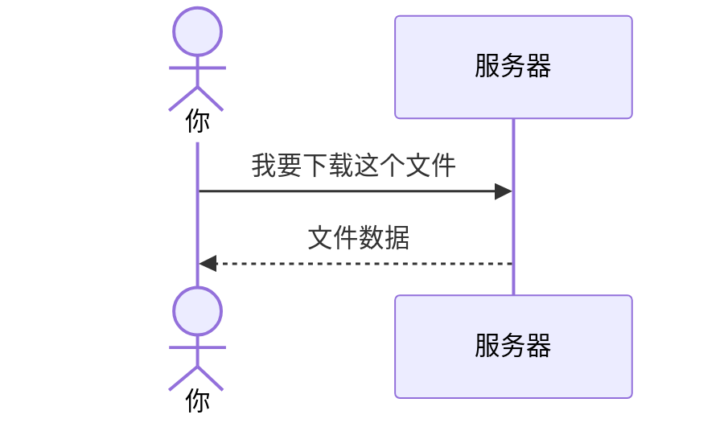
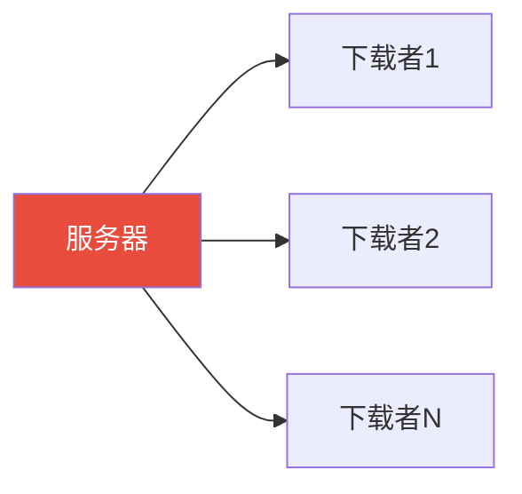
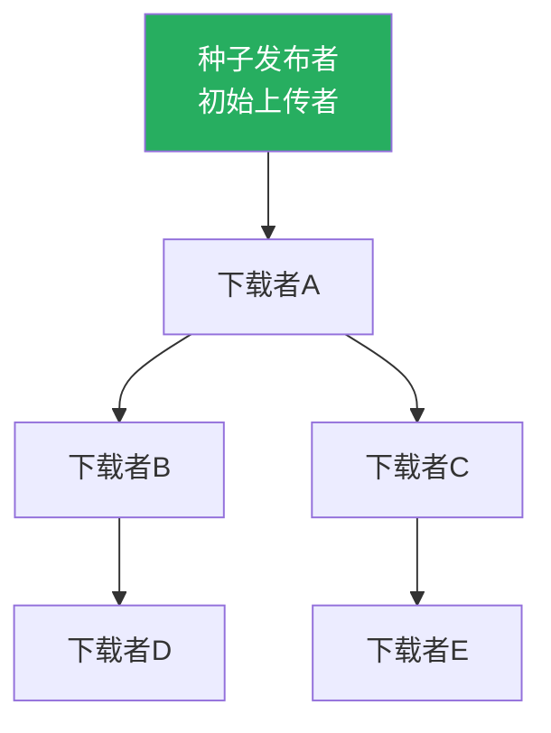
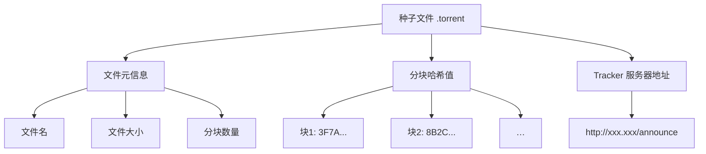
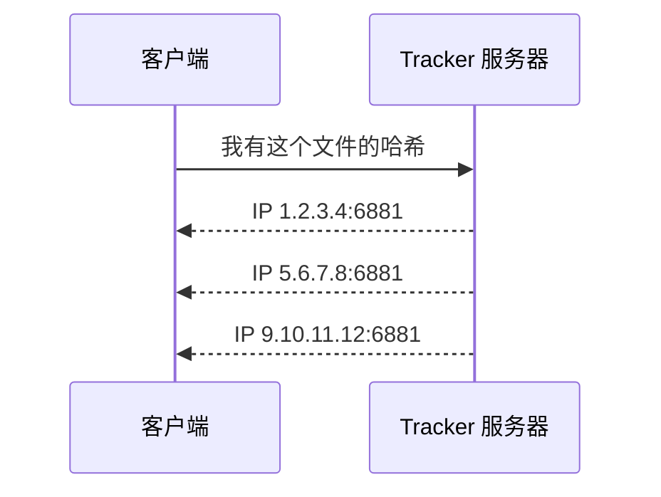
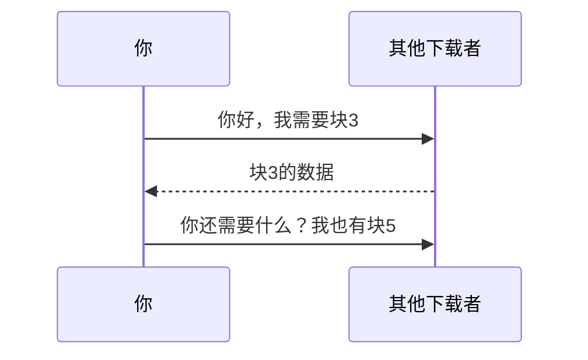
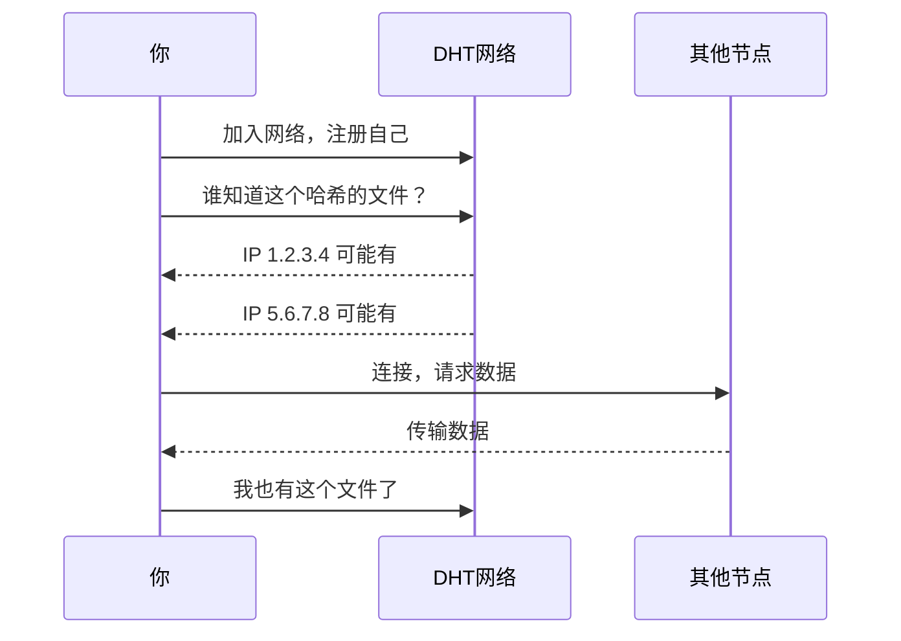
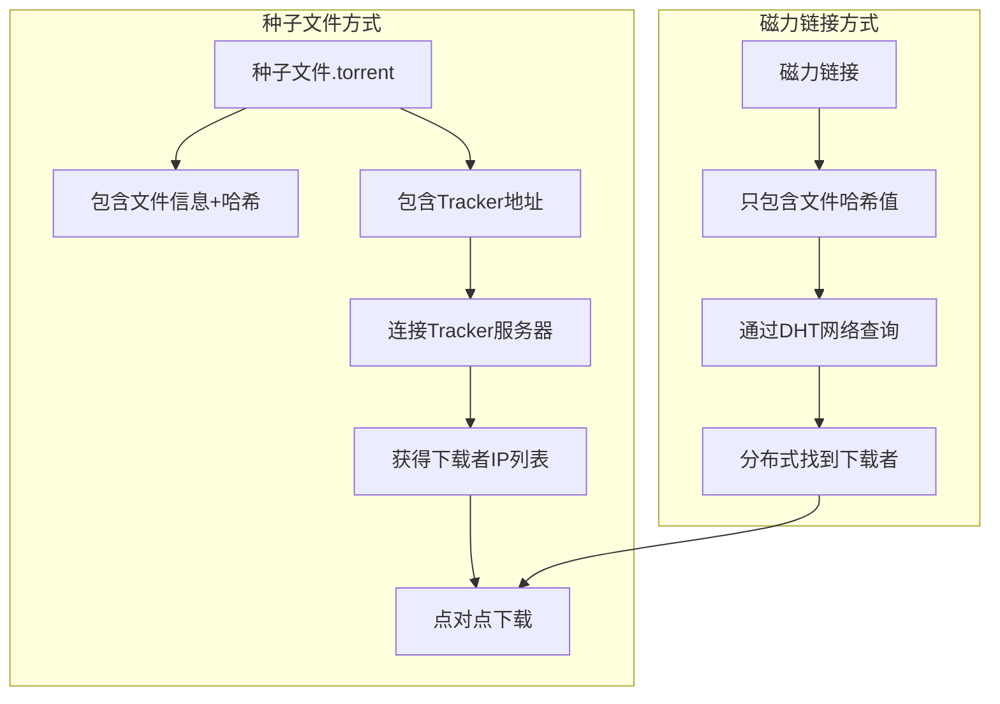

## 从一个奇怪的现象说起

你有没有想过这个问题：你下载一个热门的 BT 资源，速度很快。但是下载一个冷门的资源，可能几天都下不动。

如果你去问别人为什么，可能会得到"因为做种的人多啊"这种回答。

但这个回答引出了更大的问题：**我下载的时候，到底是谁在给我传数据？我怎么找到他的？他为什么要给我传？**

这篇文章把这些问题拆清楚。

## 先回忆一下正常的下载方式

我们平时下载文件，最常见的模式是**客户端-服务器**：



比如你从官网下载一个软件的安装包，就是这种模式：你去服务器拿，服务器给你传。

这种方式的问题是：**如果下载的人太多，服务器扛不住。** 就像一家奶茶店，排队的人越多，每个人等待的时间就越长。

## BT 下载的思路：反过来想

BT（BitTorrent）用了一个完全不同的思路：

> 下载的人越多，速度反而越快。

怎么做到的？**让下载者同时也变成上传者。**

传统模式是这样的：



而 BT 模式是这样的：



在 BT 里，**每个下载者同时也是上传者**。你从别人那里下载，同时也把你已经下载好的部分上传给其他人。

## 具体是怎么工作的？

先看种子文件（.torrent）的方式：

### 第一步：拿到种子文件

种子文件非常小（几 KB），里面不包含你要下载的实际内容。它包含的是：



哈希值是关键——它就像每一块数据的"指纹"，用来验证数据是否正确。

### 第二步：连接 Tracker 服务器

你的 BT 客户端连接种子文件里记录的 Tracker 服务器，问它："谁有这个文件？"



Tracker 服务器不存文件内容，它只是一个"通讯录"，记录着谁有这个文件。

### 第三步：直接点对点连接

你的客户端拿到 IP 列表后，直接连接这些 IP：



你下载到一块数据后，计算它的哈希值，和种子文件里的哈希对比。一致就说明数据是正确的。不一致就丢弃，从其他人那里重新下载。

### 第四步：你也在上传

下载的同时，你的客户端会把你已经有的块上传给别人。你不需要手动操作——客户端自动做这件事。

这就是为什么下载完成后不要马上关掉客户端——你在"做种"，帮助其他人下载。

## 磁力链接又是什么？

种子文件的问题在于：**你得先拿到种子文件才能开始下载。** 这就形成了一个死循环——种子文件本身也需要一个地方存放。

磁力链接解决了这个问题，它把种子文件里的信息压缩成**一串字符串**：

```text
magnet:?xt=urn:btih:3F7A8B2C...（一串很长的哈希值）
```

你把这串字符串复制到 BT 客户端里，客户端不需要种子文件就直接开始下载了。

怎么做到的？**通过 DHT 网络。**

## DHT 网络：没有中心服务器的通讯录

Tracker 服务器是一个中心化的通讯录。但如果 Tracker 服务器倒闭了或者被关了，这个文件的所有下载者就互相找不到了。

DHT（分布式哈希表）解决了这个问题——它把通讯录**分散到所有参与者手里**。



每个节点只存储一小部分"谁有什么文件"的信息。当你查询时，网络通过接力方式（A 告诉 B，B 告诉 C……）最终找到拥有文件的人。

## 回答你的具体问题

### Q: 如果对方关机了/断网了？

那就从他那里下载不了。但你的客户端会同时连接多个来源。如果当前来源不够（没有足够的人在线），下载就会停滞——这就是冷门资源下不动的原因。

### Q: 如果对方不想给我呢？

BT 协议的设计理念是**你下载的同时也在上传**。虽然技术上可以把上传关闭（称为"吸血"），但很多客户端会限制这种用户——你不上传，别人也不给你传。

### Q: 对方需要做什么才能传给我？

什么都不用做。BT 客户端在后台自动上传。你下载文件的同时，你的电脑就在默默地给别人传数据。不需要你手动操作。

### Q: 那对方岂不是什么都没做就要付出（上传流量）？

这就要说到**种子的理念**了：

- 第一个人（种子发布者）把完整的文件贡献出来，让大家下载
- 下载的人越多，上传的人也越多，下载速度越快
- 有些站点要求"下载后保持上传一段时间"（保种），否则会被封号
- 如果所有人都下载完就跑路，这个文件最后就死了——没人能下载它

这是一种**互惠机制**——每个人既获得也付出。热门资源速度快，就是因为互惠的人多。

### Q: 我怎么确保下载的内容是正确的？有人发损坏的数据怎么办？

哈希值就是答案。下载完每一块数据，客户端都会计算它的哈希值，和磁力链接里的哈希比对。不匹配就丢弃，从其他人那里重新下载。这保证了**即使从不可信来源下载，你得到的文件也是正确的。**

## 总结一下



拿现实世界来类比：

- **传统下载**（客户端-服务器）：你去图书馆借书，图书馆把书复印一份给你。去的人越多，图书馆越忙。
- **BT 下载**（P2P）：你想看一部电影，你的朋友有这部电影，他复印了一页给你，你收到后复印给下一个朋友。参与的人越多，复印的速度越快。
- **Tracker 服务器**：一个公告栏，写着"谁有这部电影"。
- **DHT 网络**：没有公告栏，你逢人就问"你知道谁有这部电影吗？"，经过几个人传话后，你就找到了。

希望这篇文章让你对 P2P 下载有了一个清晰的认知。这确实是一个很巧妙的设计——把一个中心化的负担变成了分布式的协作。
